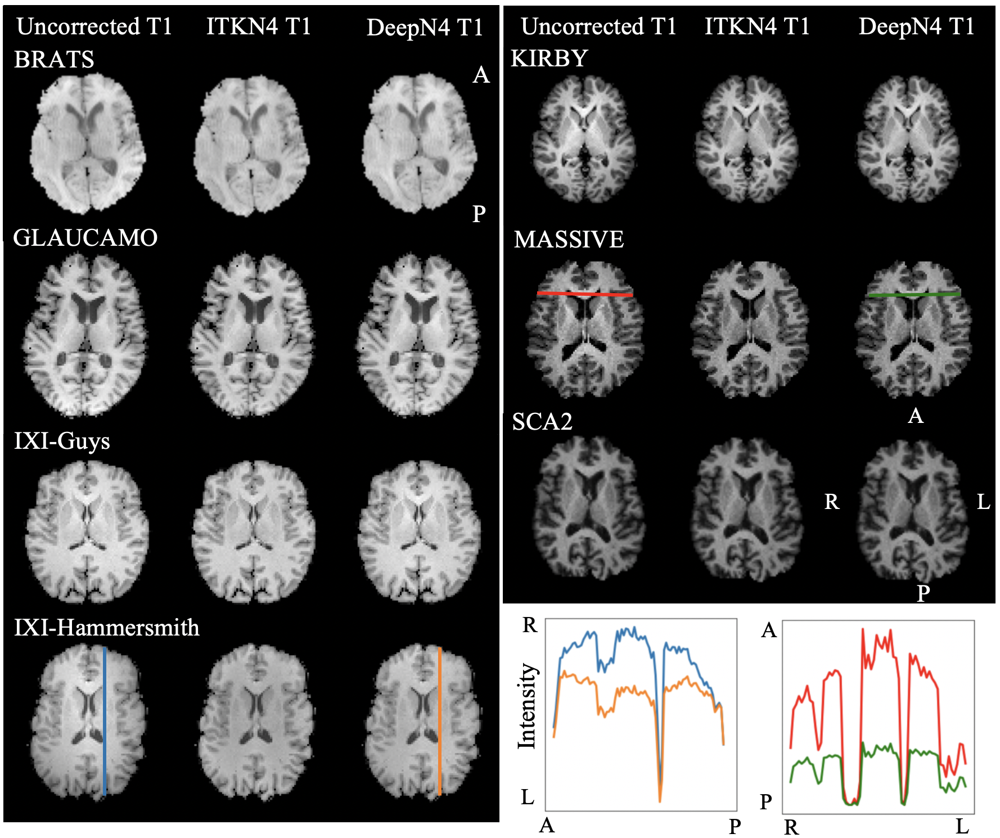

### DeepN4

Official Pytorch implementation of DeepN4, from the paper: 
DeepN4: Learning ITKN4 Bias Field Correction for T1 weighted Images 

---
We propose **DeepN4**, a 3D UNet to generate Bias Field for T1w images and inturn corrected T1w images for inhomogeneity  

<p align="center">

</p>


 ## Installation
 Please look into the ### for creating conda environment and package installation procedures.

<!-- ✅ ⬜️  -->
## Training
Training and fine-tuning instructions are in ###. Pretrained model weights will be uploaded for public usage later on.

<!-- ✅ ⬜️  -->
## Evaluation
Efficient evaulation can be performed for the public datasets as follows:
```
python test_seg.py --root path_to_image_folder --output path_to_output \
--dataset flare --network 3DUXNET --trained_weights path_to_trained_weights \
```


