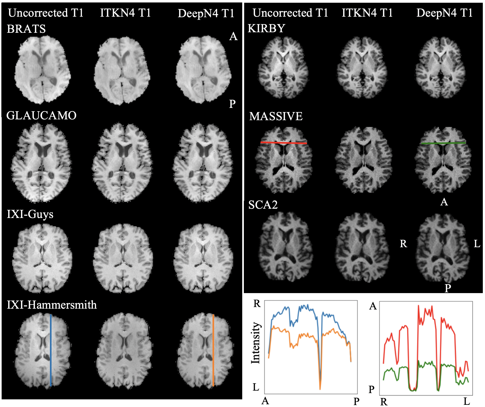

# DeepN4
Pytorch implementation of DeepN4, from the paper: DeepN4: Learning ITKN4 Bias Field Correction for T1 weighted Images. 
We propose **DeepN4**, a 3D UNet to generate Bias Field for T1w images and inturn correct T1w images for inhomogeneities.

<p align="center">

</p>

## Prequisite installation
Please look into `requirements.txt` for libraries and versions used in the virutal environment. 

## Training and Testing
1. Input train/test/val format: csv file with each row with `/path/to/corrected_T1.nii.gz,/path/to/input.nii.gz,/path/to/bias_field.nii.gz` for each subject 
2. Run training 
```
python main.py train 0 Synbo_UNet3D False /path/to/save/model /path/to/tensorboard/output \
/path/to/save/predictions checkpoint_epoch_# guass \
```
3. Run testing 
```
python main.py pred 0 Synbo_UNet3D False /path/to/saved/model /path/to/tensorboard/output \ 
/path/to/save/predictions checkpoint_epoch_# guass \
```

## External evaluation 

Efficient evaulation can be performed for the public datasets as in `Evaluation_deepN4.ipynb`. The example data used is in `data/` 
The trained weights and the singualrity image can be downloaded from https://drive.google.com/drive/folders/1mdBsV0kHRRV_Alu1QJrTT7N0GGNJDuiu?usp=sharing   


## Singularity 

To containize the source code 
```
sudo singularity build deepn4v1.simg Singularity
```

To run singularity 
```
singaulrity run
--contain -e
-B /path/to/inputs/directory/:/INPUTS
-B /path/to/outputs/directory/:/OUTPUTS
-B /tmp:/tmp
-B /path/to/freesurfer/license.txt:/APPS/freesurfer/license.txt
deepn4v1.simg
[options]
```

Inputs and arguments for singularity
Input Directory: one T1 image named as t1.nii.gz
Output Directory: results will be saved as t1processed.nii.gz and (if the option below is on) bias.nii.gz
Options: "--bias_file" to save the bias field field

---


